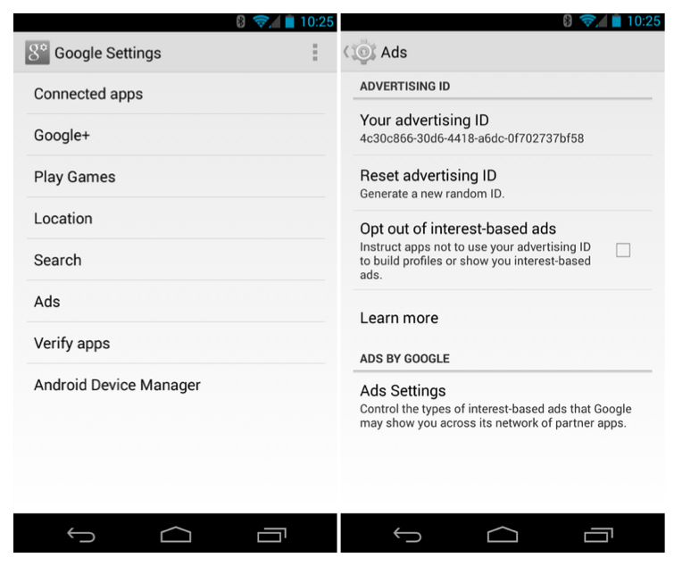
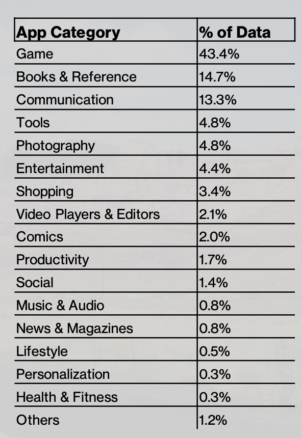

## Data

Data pergerakan *(mobility)* termasuk jenis SIGINT *(signal intelligence)*, memerlukan mekanisme khusus untuk memperolehnya. Berbeda dengan OSINT *(open source intelligence)* seperti data berita atau sosial media.

Data berisikan identifikasi, *latitude*, *longitude*, dan *timestamp*. Identifikasi (ID) *smartphone* Android berasal dari MAID *(Mobile Advertising Identifier)* atau Ad Id *(Advertising Identifier)*. Untuk *smartphone* iOS dinamakan IFDA *(Identifier for Advertisers* atau IDFA). Terdiri dari 32 *hyphen-separated* karakter, contoh: `3f097372-f01e-4b64-984c-395ae5828ee6`. Untuk menjaga privasi, data identifikasi tersebut dianonimkan.

Contoh dalam perangkat Android bisa dilihat pada Gambar 1.

*Gambar 1. MAID pada Android*

Data *latitude* dan *longitude* diperoleh dari *app* dalam *smartphone* yang mengirimkan posisi GPS, ketika terdapat *update*, kepada agregator. *Update app* termasuk ketika diaktifkan atau melakukan transaksi. Kategori *app* yang menggunakan fitur MAID bisa dilihat pada Gambar 2.

*Gambar 2. App kategori [1]*

---

## Perolehan dan Penggunaan

Data yang dibagi merupakan data pergerakan *(mobility)* yang mencakup wilayah DIY (Daerah Istimewa Yogyakarta) dari Oktober 2021 - Mei 2022. Data diperoleh dari agregator untuk keperluan pembelajaran dan penelitian yang dilakukan oleh civitas UGM. 

Penelitian mengenai pola pergerakan manusia, maupun penerapan dalam berbagai bidang seperti transportasi, pariwisata, dan perencanaan kota bisa dilakukan dengan memanfaatkan data tersebut. Selain keperluan penelitian, pembelajaran di kelas maupun praktikum berbasis informasi spasial juga dimungkinkan.

---

## Privasi

Agregator mengumpulkan semua data yang sepenuhnya dianonimkan. *Publisher* dari *smartphone app* menggunakan beberapa platform untuk memperoleh izin dari pengguna *(user consent)* dan juga menyediakan mekanisme *opt-out* (penolakan).

---
**Referensi:**
[1] Digipop Research Platform, MD Media, *unpublished*